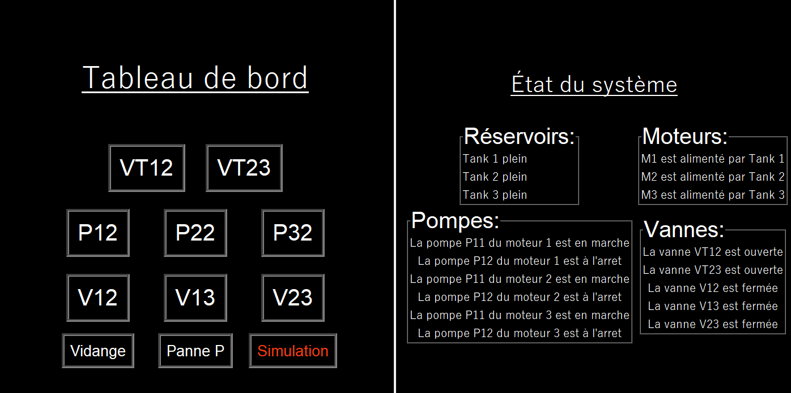

# Simulation de système de carburant pour avion
Ce projet est un simulateur Python du système carburant d'un avion. Le simulateur permet aux pilotes de s'entraîner à gérer les pannes et à reconfigurer le système en vol, en s'appuyant sur des actions comme l'ouverture/fermeture des vannes, l'activation/désactivation des pompes, et la gestion des réservoirs de carburant. Il permet de visualiser l'état des réservoirs, des pompes et des moteurs, et propose une interface graphique pour interagir avec le système.

Le système carburant est composé de trois réservoirs (Tank1, Tank2, Tank3), de plusieurs pompes (primaires et de secours) et de vannes permettant d'acheminer le carburant aux trois moteurs (M1, M2, M3). En cas de panne, le pilote peut réagir en changeant la configuration du système pour assurer l'alimentation des moteurs.

**Voici le diagramme du systeme de carburant :**


## Fonctionnalités principales
### Gestion du Système Carburant
Le simulateur permet de gérer plusieurs éléments clés du système carburant :

- **Réservoirs** : Chaque réservoir peut être plein ou vide.
- **Pompes** : Chaque réservoir est équipé d'une pompe primaire et d'une pompe de secours qui peuvent être en marche, arrêtées ou en panne.
- **Vannes** : Les vannes peuvent être ouvertes ou fermées pour contrôler le flux de carburant entre les réservoirs et les moteurs.

### Simulation des Pannes
L'utilisateur peut déclencher des pannes dans le système, comme :

- La panne des pompes (primaire ou de secours).
- La vidange des réservoirs.

### Actions du Pilote
Le pilote peut effectuer les actions suivantes pour gérer le système :

- **Ouvrir/Fermer les vannes** : Contrôler le flux de carburant entre les réservoirs et les moteurs.
- **Démarrer/Arrêter les pompes** : Activer les pompes de secours en cas de panne.

### Reconfiguration du Système
En cas de panne, le pilote peut :

- Fermer les vannes entre réservoirs pour équilibrer le niveau de carburant.
- Alimenter un moteur depuis un autre réservoir en activant la pompe de secours correspondante et en ouvrant la vanne appropriée.

## Interface Utilisateur
L'application comprend deux interfaces principales :

1. **Tableau de bord du pilote** : Cette interface permet à l'utilisateur de contrôler les vannes et pompes pour gérer le flux de carburant.
2. **État du système** : Une interface secondaire permet de visualiser l'état des réservoirs (plein/vide), l'état des pompes (en marche/arrêt/panne), et des vannes (ouvertes/fermées). Elle permet également d'injecter des pannes dans le système.

**Voici un aperçu de l'interface utilisateur :**



## Exécution du projet

### Prérequis

- **Python 3.x** installé
- Bibliothèque `tkinter` pour l'interface graphique
- Bibliothèque `os` pour la gestion des fichiers

Vous pouvez installer les dépendances nécessaires avec :

```bash
pip install tkinter os
```
    
### Fonctionnement

1. **Tableau de bord** : permet de naviguer entre les différentes options pour simuler des événements (vidange, panne, etc.)
2. **État du système** : visualisez en temps réel les états des composants du système de carburant.
3. **Vidange** : déclenchez des vidanges pour les réservoirs.
4. **Panne** : simulez des pannes sur les pompes des moteurs.

## Exemple de panne et stratégie de réactivation des moteurs

#### Scénario de panne :
Supposons que **Tank1** subisse une défaillance (par exemple une panne des pompes p11 et p12 associées à Tank1). En conséquence, le **Moteur 1 (M1)** ne reçoit plus de carburant et s'arrête.

#### Objectif :
Réactiver **M1** en redirigeant le carburant des réservoirs **Tank2** et/ou **Tank3** tout en maintenant l'approvisionnement des moteurs **M2** et **M3**.

#### Étapes pour réactiver M1 :

1. **Ouvrir les valves pour rediriger le carburant des autres réservoirs :**
   - Ouvrir la valve **V12** pour permettre à **Tank2** de fournir du carburant au **Moteur 1 (M1)**.

2. **Activer la pompe de secours de Tank2 (P22) :**
   - L'acivation de la pompe de secours **P22** permettera la remise en service du **Moteur 1 (M1)**.
   - **Moteur 1 (M1)** continue de fonctionner normalement en étant alimenté par **Tank2**.

#### Résultat :
Après avoir suivi ces étapes :
- **Moteur 1 (M1)** est de nouveau alimenté par **Tank2** via l'ouverture de **V12** et l'activation de **P22**.
- **Moteur 2 (M2)** continue de fonctionner normalement avec l'alimentation de **Tank2**.
- **Moteur 3 (M3)** reste fonctionnel en étant alimenté par **Tank3**.

## Idées d'amélioration :

- **Système de points** : Implémenter un mécanisme de scoring qui évalue la performance de la gestion du carburant après chaque simulation.
- **Gestion précise de l'essence** : Attribuer des valeurs numériques spécifiques aux niveaux de carburant dans les réservoirs et aux consommations des moteurs pour plus de précision.
- **Ajouts de reservoirs de secours** : Intégrer des réservoirs de secours pour simuler des scénarios d'urgence en cas de panne ou de défaillance des réservoirs principaux.
